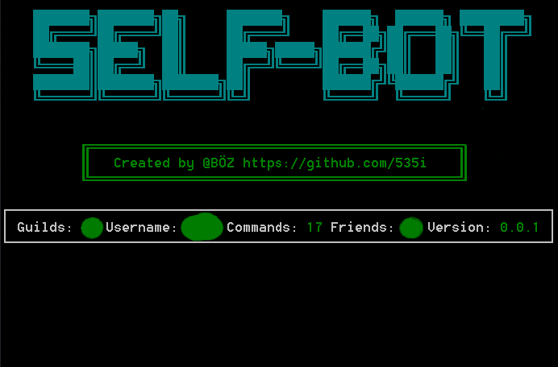

# Important
SelfBots are against Discord's Terms of Service and you can get your account banned, if you get caught using this selfbot, or any selfbot in general.
Use it at your own risk. I am not responsible for anything that happens to your account while/after using this program.

## Discord SelfBot

  

## Installation
> Make sure to install [Git](https://git-scm.com/downloads), because the current PyPi version of [discord.py-self](https://github.com/dolfies/discord.py-self) does not work

1. Clone the repository: `git clone https://github.com/535i/discord-selfbot.git` or download the `.zip`

2. Install the requirements: `pip install -r requirements.txt`

3. Copy your User ID and paste it inside the `config.py` file
  
4. Start the selfbot: `python main.py`, or run the `.bat` file

## Configuration
  
Name | Meaning
--- | ---
`prefix` | Put in a prefix of your choice
`ownerid` | Your User ID
`del_messages` | When should messages be deleted. If not leave it as `None`

## Features
* Basic commands
* More coming soon

## Acknowledgements
* [discord.py](https://github.com/Rapptz/discord.py)
* [discord.py-self](https://github.com/dolfies/discord.py-self)
